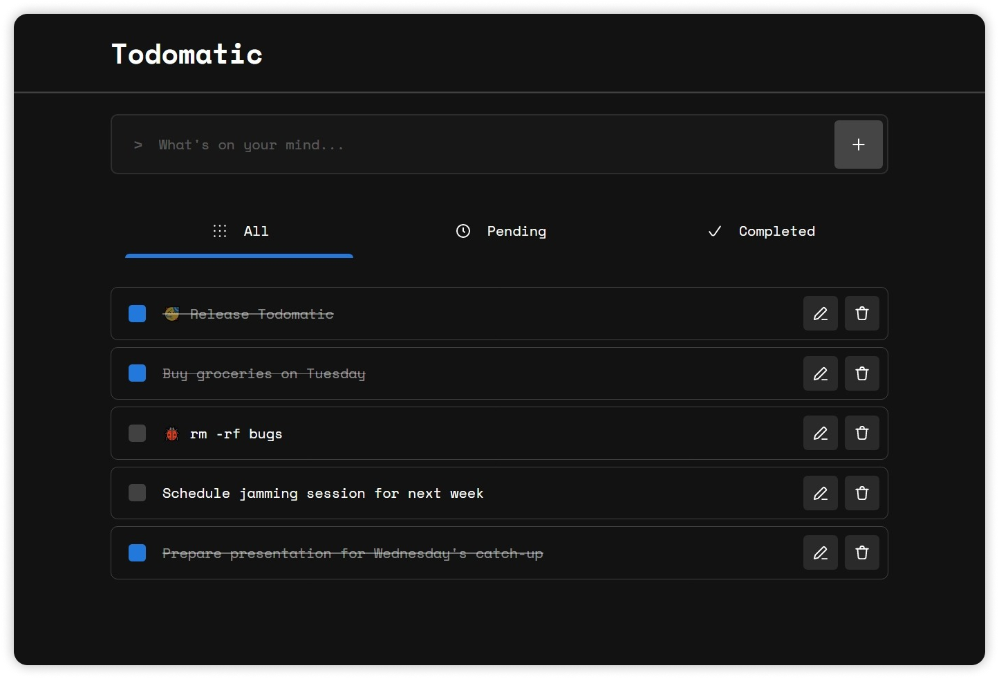

# ⚡ Todomatic

A simple todo web application written in **React + Typescript**. Try out now on <https://melvin-abraham.github.io/todomatic/>

## Features

- 😉 **Minimalistic UI** so that you can focus on what you want to achieve

- 👀 Easy on eyes with **dark themed** interface

- ✨ **Intuitive experience** with _subtle sound effects and animations_

- ✅ Focus on **accessiblity**

## Sceenshot

